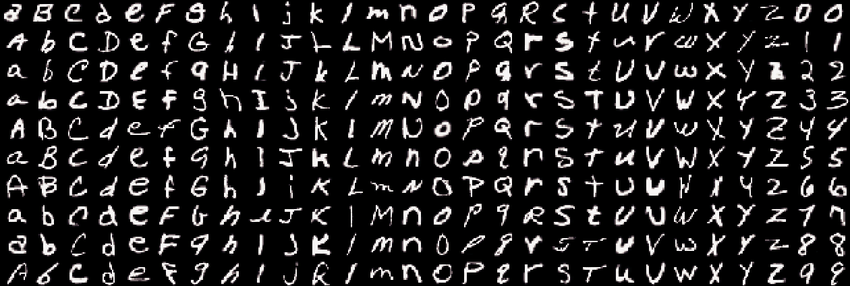

# Handwritten Text Recognition using EMNIST


This project focuses on the recognition of handwritten characters using machine learning and deep learning algorithms. It utilizes the EMNIST dataset, which contains handwritten digits [0-9] and letters [A-Za-z]. The goal is to accurately classify and categorize these characters.

## Dataset Used
The <a href="https://www.kaggle.com/datasets/crawford/emnist" target="_blank">EMNIST Dataset</a>, a widely used benchmark dataset for character recognition, is used in this project. It consists of grayscale images of handwritten characters, along with corresponding labels indicating the character class.

## Features

- Multiple approaches to handwritten text recognition:
  - Deep Learning models (CNN)
  - Traditional Machine Learning models
- Cross-validation experiments for model evaluation
- Interactive application interface
- Support for various image formats
- Model weights saving and loading functionality

## Requirements

- Python 3.x
- TensorFlow/Keras
- OpenCV
- scikit-learn
- NumPy
- Pandas
- Jupyter Notebook


# Machine Learning Algorithms
Several machine learning algorithms are employed for character recognition. 
The following algorithms are implemented with their respective source code and accuracy scores:

| Model               | Accuracy | Precision | Recall | F1 Score |
|--------------------|----------|-----------|---------|-----------|
| SVM                | 84.37%   | 84.50%    | 84.37%  | 84.19%    |
| Random Forest      | 81.19%   | 81.19%    | 81.19%  | 80.99%    |
| KNN                | 78.29%   | 79.32%    | 78.29%  | 78.22%    |
| Naive Bayes        | 27.63%   | 42.24%    | 27.63%  | 24.12%    |

## Convolutional Neural Network (CNN)
This section demonstrates the implementation of a Convolutional Neural Network (CNN) for the recognition of handwritten characters. CNNs have shown exceptional performance in image recognition tasks, making them well-suited for character recognition from image data.


### Model Compilation
The CNN model is compiled with the categorical cross-entropy loss function, the Adam optimizer, and accuracy as the evaluation metric. The Adam optimizer efficiently adapts the learning rate for faster convergence.


### Callbacks
Three callbacks are employed to improve model performance and prevent overfitting during training:

- EarlyStopping: This callback monitors the validation loss and stops training if it doesn't improve for 5 epochs, preventing overfitting.
- ModelCheckpoint: This callback saves the best model during training based on validation loss for later use.
- ReduceLROnPlateau: This callback reduces the learning rate if validation loss plateaus for 3 epochs, allowing the model to fine-tune.


### Building the Model

```python
cnn_model = Sequential([
    layers.Conv2D(filters=32, kernel_size=(5, 5), padding='same', activation='relu', input_shape=(28, 28, 1)),
    layers.MaxPool2D(strides=2),
    
    layers.Conv2D(filters=48, kernel_size=(5, 5), padding='valid', activation='relu'),
    layers.MaxPool2D(strides=2),
    
    layers.Conv2D(filters=64, kernel_size=(3, 3), padding='same', activation='relu'),
    layers.MaxPool2D(strides=2),
    
    layers.Flatten(),
    
    layers.Dense(256, activation='relu'),
    layers.Dense(84, activation='relu'),
    
    layers.Dropout(0.2),
    
    layers.Dense(number_of_classes, activation='softmax')
])
```

### Model Evaluation
The CNN model performed really well, here is the result:

```python
Best accuracy: 0.8904 # We have an 89,01% accurate model
Best loss value: 0.2377
```


The CNN model achieved an accuracy of approximately 89.04% on the validation set after training for 9 epochs. The early stopping callback prevented further training as the validation loss reached a limit, ensuring the model's optimal performance and avoiding overfitting.

## Installation

1. Clone this repository:
```bash
git clone [your-repo-url]
```

2. Create and activate a virtual environment:
```bash
python -m venv env
source env/bin/activate  # On Windows: env\Scripts\activate
```

3. Install the required packages:
```bash
pip install -r requirements.txt
```

## Usage

1. Open Jupyter Notebook:
```bash
jupyter notebook
```

2. Navigate to `src/application.ipynb` to run the main application
3. For model training and experimentation:
   - `cnn_model.ipynb`: CNN model implementation and training
   - `machine_learning_models.ipynb`: Traditional ML approaches
   - `cross_val.ipynb`: Model evaluation and cross-validation


## Conclusion

This project demonstrates the effectiveness of different machine learning approaches for handwritten text recognition:

- The CNN model achieved the best performance with 89.04% accuracy, showcasing the power of deep learning for image recognition tasks
- Traditional ML models like SVM (84.37%) and Random Forest (81.19%) also showed strong performance
- The comprehensive preprocessing pipeline and model evaluation framework ensure robust and reliable results
- The interactive application interface makes the models accessible for practical use

Future improvements could include:
- Implementing data augmentation techniques
- Exploring more complex CNN architectures
- Adding support for continuous text recognition
- Improving the user interface for better accessibility